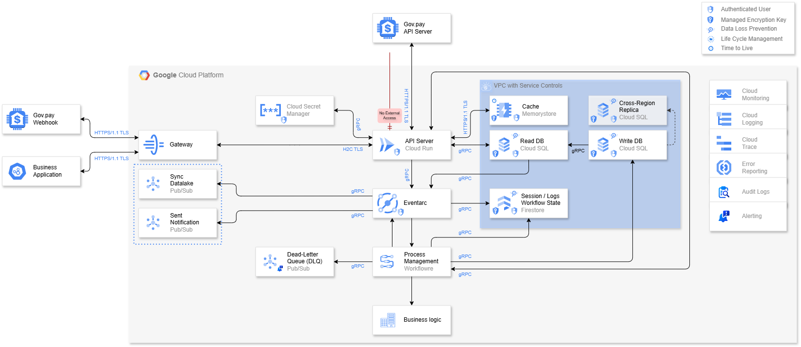
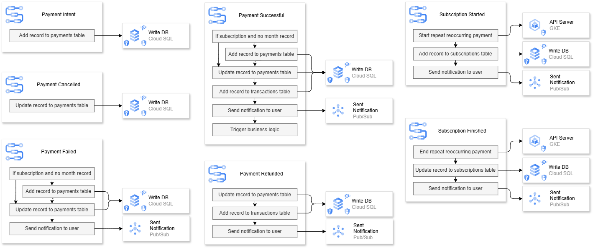

# Payment Processing Platform

A cloud-native, event-driven payment processing microservice built on Google Cloud Platform. Designed to be fast, fault-tolerant, scalable, and cost-effective, with developer experience and stakeholder observability built in from the ground up.

---

## Architecture Overview



The platform is split into two primary concerns:

- **Infrastructure & data flow** — how requests enter the system, are processed, and persisted
- **Event workflows** — how payment lifecycle events trigger the correct business logic

---

## Request Flow

```
Gov.pay Webhook / API Server
        │
        ▼ HTTPS 1.1 / TLS
    Gateway  ◄───────────────────────────────────────────────────┐
        │                                                        │
        │ HTTP/2 (H2C) / TLS                                     │
        ▼                                                        │
  API Server (Cloud Run)  ──── No Direct External Access         │
        │                                                        │
        ├─── gRPC ──► Cache (Memorystore)                        │
        ├─── gRPC ──► Read DB (Cloud SQL)                        │
        ├─── gRPC ──► Write DB (Cloud SQL)                       │
        ├─── gRPC ──► Session / Logs / Workflow State (Firestore)│
        ├─── gRPC ──► Eventarc                                   │
        │                   │                                    │
        │                   ▼                                    │
        │          Process Management (Workflows)                │
        │                   │                                    │
        │           ┌───────┴──────────┐                         │
        │           ▼                  ▼                         │
        │    Business Logic      Dead-Letter Queue (DLQ)         │
        │                                                        │
        ├─── gRPC ──► Sync Datalake (Pub/Sub) ───────────────────┘
        └─── gRPC ──► Sent Notification (Pub/Sub)
```

---

## Components

### Gateway
- Entry point for all external traffic
- Converts **HTTPS 1.1 → HTTP/2 (H2C)** and vice versa
- Enforces that the API server has **no direct external access** — all requests must pass through the gateway
- Provides a consistent, secure perimeter for the platform

---

### API Server — Cloud Run (GoLang)
- Written in **GoLang** — optimal for cloud-native, high-throughput services
- Python or Node.js can be substituted if required by team preference
- **Minimum instance size of 1** to eliminate cold starts
- Benefits of Cloud Run:
  - Low maintenance overhead — no infrastructure to manage
  - Cost-effective with pay-per-use scaling
  - Scales automatically during traffic spikes
  - Native integration with GCP security and IAM
- Communicates internally via **gRPC** for native-speed, strongly typed messaging
- Secrets and credentials accessed via **Cloud Secret Manager** — no hardcoded keys, easy rotation

---

### Data Layer (VPC with Service Controls)

All data infrastructure is contained within a **VPC with Service Controls**, preventing data exfiltration and isolating the data plane from external access.

#### Cache — Memorystore (Redis)
- Stores frequently accessed and recently transacted data
- Reduces read latency and offloads the primary database
- Particularly useful for payment state lookups during active sessions

#### Primary Database — Cloud SQL (PostgreSQL)
- Chosen for its **ACID transactional guarantees** — essential for financial data integrity
- Right-sized for mid-scale implementations
- **Cross-Region Replica with High Availability** configured for disaster recovery
- For global or high-scale deployments, consider migrating to **Cloud Spanner**

> **Database Security:**
> - Google-managed encryption at rest
> - **Data Loss Prevention (DLP)** — detects and protects sensitive data
> - **Lifecycle Management** — automated data retention policies
> - **Time to Live (TTL)** — automatic expiry of transient records
> - IAM-enforced access controls

#### Session, Logs & Workflow State — Firestore
- Stores ephemeral and semi-structured data: user sessions, event logs, and workflow state
- Chosen for its flexible schema, low-latency reads, and native GCP integration

---

### Event-Driven Processing

#### Eventarc
- **Decouples the API server from downstream processing**
- Converts synchronous API actions into events
- Protects the database from sudden request surges — events are processed at a controlled rate
- Reduces burden on the API server — fire and forget, no waiting for downstream completion

#### Process Management — Workflows (YAML)
- Orchestrates all payment lifecycle events
- Written in **YAML** — expressive, readable, and supports conditional logic
- Different workflow paths are triggered based on the event type received from Eventarc
- **Retry logic with exponential backoff** is configured for transient failures, giving blips time to clear without overwhelming downstream services

#### Dead-Letter Queue (DLQ) — Pub/Sub
- Receives messages that have exhausted all retry attempts
- Prevents lost events — every failed message is captured for investigation and reprocessing
- **Alert policy with a threshold of 1** — any message entering the DLQ triggers an immediate alert
- Enables engineering teams to investigate root causes without data loss

---

### Messaging & Integration

#### Sync Datalake — Pub/Sub
- Streams processed payment data into the data lake
- Enables business intelligence, analytics, and reporting for stakeholders
- Decoupled from the main request path — does not affect user-facing latency

#### Sent Notification — Pub/Sub
- Delivers user-facing notifications (payment confirmation, failure alerts, subscription changes)
- Asynchronous — notifications are dispatched without blocking the primary flow

---

### External Integration — Payment Providers

The platform is designed to be **payment provider agnostic**. The underlying architecture remains unchanged regardless of which provider(s) are used — only the API server requires additional routing logic to direct transactions to the correct provider.

This makes it straightforward to:
- Swap the payment provider entirely (e.g. migrating from one provider to another)
- Run multiple providers simultaneously (e.g. public sector and private sector products on the same platform)

#### Provider Routing (multi-provider)
When multiple providers are configured, the API server determines which provider to route a transaction to based on context (e.g. product type, region, organisation). Each provider integration follows the same two-channel pattern below.

#### Example Providers

| Sector | Example Providers |
|---|---|
| Public / Government | Gov.pay, Capital Pay 365 |
| Private | Stripe, Worldpay |

#### Integration Pattern (per provider)

| Channel | Direction | Protocol |
|---|---|---|
| Provider Webhook | Inbound → Gateway | HTTPS 1.1 / TLS |
| Provider API Server | Outbound ← API Server | HTTPS / TLS |

---

## Payment Workflows



Each payment event type maps to a distinct workflow:

### Payment Intent
1. Add record to `payments` table → Write DB

### Payment Cancelled
1. Update record in `payments` table → Write DB

### Payment Failed
- If subscription exists with no month record:
  1. Add record to `payments` table
  2. Update record in `payments` table → Write DB
  3. Send notification to user → Sent Notification

### Payment Successful
- If subscription exists with no month record:
  1. Add record to `payments` table
  2. Update record in `payments` table
  3. Add record to `transactions` table → Write DB
  4. Send notification to user → Sent Notification
  5. Trigger business logic

### Payment Refunded
1. Update record in `payments` table
2. Add record to `transactions` table → Write DB
3. Send notification to user → Sent Notification

### Subscription Started
1. Start repeat recurring payment → API Server (GKE)
2. Add record to `subscriptions` table → Write DB
3. Send notification to user → Sent Notification

### Subscription Finished
1. End repeat recurring payment → API Server (GKE)
2. Update record in `subscriptions` table → Write DB
3. Send notification to user → Sent Notification

---

## Compliance

The platform is designed with regulatory compliance embedded at the infrastructure level, not bolted on afterwards. The GCP-native tooling used throughout aligns directly with the requirements of each framework below.

---

### GDPR — General Data Protection Regulation

Applicable when processing personal data of individuals in the UK or EU.

| Requirement | Implementation |
|---|---|
| Data minimisation | Only data necessary for payment processing is captured and stored |
| Right to erasure | TTL and Lifecycle Management policies on Cloud SQL and Firestore enable automated and on-demand data deletion |
| Data protection by design | DLP (Data Loss Prevention) scans and protects sensitive fields at rest and in transit |
| Lawful processing records | Audit Logs provide an immutable record of all data access and processing activity |
| Breach notification | Cloud Monitoring and Alerting enable rapid detection and response to anomalous access patterns |
| Data transfer controls | VPC Service Controls prevent data leaving defined perimeters; regional Cloud SQL instances keep data in-region |

---

### Data Sovereignty

Applicable when operating under jurisdictions that require data to remain within specific geographic boundaries (e.g. UK, EU member states, government contracts).

| Requirement | Implementation |
|---|---|
| Data residency | Cloud SQL, Firestore, Memorystore, and Pub/Sub are deployed to specific GCP regions — data does not leave the configured region |
| Cross-region replica | The HA replica can be constrained to an approved region pair (e.g. `europe-west2` / `europe-west1` for UK) |
| Provider isolation | VPC Service Controls enforce boundaries that prevent data exfiltration even by internal services |
| Audit trail | Audit Logs record where data is accessed from and by which identity |

> For deployments requiring strict sovereignty (e.g. UK government), ensure all services are pinned to approved regions and Cloud Spanner's multi-region config (if adopted) uses only in-boundary replicas.

---

### SOC 2 — Service Organisation Control 2

Applicable when handling customer data on behalf of organisations; demonstrates trust service criteria around security, availability, and confidentiality.

| Trust Criteria | Implementation |
|---|---|
| **Security** | IAM enforces least-privilege access across all services; Secret Manager eliminates credential exposure; VPC isolates the data plane |
| **Availability** | Cloud Run auto-scaling with min instance of 1; Cross-region HA replica; Eventarc + Workflows decouple processing to prevent cascading failures |
| **Confidentiality** | Encryption at rest (Google-managed keys); TLS/gRPC in transit; DLP prevents sensitive data leakage |
| **Processing integrity** | ACID transactions on PostgreSQL; retry logic with backoff; DLQ ensures no events are silently dropped |
| **Change management** | All infrastructure changes via Terraform (version controlled); CI/CD pipeline with Cloud Build and Cloud Deploy enforces reviewed, auditable deployments |
| **Monitoring & logging** | Cloud Monitoring, Logging, Trace, Error Reporting, and Audit Logs provide continuous observability |

---

### PCI DSS — Payment Card Industry Data Security Standard

Applicable when processing, storing, or transmitting cardholder data.

> **Important:** The preferred approach is to minimise PCI DSS scope by ensuring raw cardholder data (PANs, CVVs) never touches this platform directly. Payment providers such as Stripe, Worldpay, and Gov.pay handle card capture via their own PCI-compliant hosted fields or tokenisation. This platform processes **payment tokens and transaction references only**, not raw card data.

| Requirement | Implementation |
|---|---|
| Protect cardholder data | Tokenisation via payment provider — raw card data never enters this system |
| Encrypt transmission | HTTPS/TLS for all external communication; gRPC/TLS internally |
| Access control | IAM enforces least-privilege; Secret Manager controls credential access |
| Monitor and test networks | Cloud Logging, Audit Logs, and Alerting provide continuous monitoring |
| Vulnerability management | Cloud Run managed runtime reduces attack surface; Artifact Registry scans container images |
| Network segmentation | VPC with Service Controls isolates data infrastructure from external access |

If cardholder data must be stored (e.g. for specific compliance scenarios), additional controls are required: customer-managed encryption keys (CMEK), stricter DLP rules, and a formal PCI DSS audit scope assessment.

---

### KYC — Know Your Customer

Applicable when onboarding users who must be verified before transacting (common in financial services and regulated payment platforms).

| Requirement | Implementation |
|---|---|
| Identity verification | KYC checks are performed at onboarding — the payment platform only processes transactions for verified identities |
| Verification records | KYC status and verification audit trail stored in Cloud SQL with Lifecycle Management and Audit Logging |
| Data protection | KYC documents and PII are subject to the same DLP, encryption, and access controls as payment data |
| Provider integration | KYC providers (e.g. Onfido, Jumio, or Gov.uk Verify for public sector) can be integrated via the same provider-agnostic pattern as payment providers — the API server routes to the appropriate KYC provider |
| Ongoing monitoring | Transaction monitoring patterns can be fed into the Datalake via the Sync Datalake Pub/Sub topic for downstream AML (Anti-Money Laundering) analysis |

---

> **Note:** This document describes the platform's architectural alignment with each compliance framework. Achieving formal certification (e.g. SOC 2 Type II, PCI DSS QSA audit) requires engagement with an accredited auditor and may require additional controls depending on your specific use case and data classification.

---

## Security

| Layer | Control |
|---|---|
| Network perimeter | Gateway enforces all external access; Cloud Run has no public exposure |
| Secrets management | Cloud Secret Manager — no hardcoded credentials, easy rotation |
| Identity & access | IAM roles enforced across all GCP resources |
| Data encryption | Google-managed encryption keys on all databases |
| Data protection | DLP, Lifecycle Management, TTL on all data stores |
| Network isolation | VPC with Service Controls around all data infrastructure |
| Transport security | HTTPS 1.1/TLS (external), HTTP/2 H2C/TLS (internal), gRPC (service-to-service) |

---

## Protocols

| Protocol | Used Between |
|---|---|
| HTTPS 1.1 / TLS | External clients ↔ Gateway, Gov.pay Webhook ↔ Gateway |
| HTTP/2 (H2C) / TLS | Gateway ↔ Cloud Run API Server |
| gRPC | Cloud Run ↔ all internal services (Cache, DBs, Firestore, Eventarc, Pub/Sub) |

The Gateway handles all protocol translation — external clients and Gov.pay use standard HTTPS, while the internal platform communicates using the most efficient available protocol.

---

## Observability

| Tool | Purpose |
|---|---|
| Cloud Monitoring | Metrics, dashboards, uptime checks |
| Cloud Logging | Centralised structured log ingestion |
| Cloud Trace | Distributed request tracing across services |
| Error Reporting | Automatic error aggregation and alerting |
| Audit Logs | Immutable record of all admin and data access activity |
| Alerting | Configurable alert policies — DLQ threshold of 1 is pre-configured |

---

## Technology Choices — Rationale

| Technology | Rationale |
|---|---|
| **GoLang** | Optimal for cloud-native services: low memory footprint, high concurrency, fast startup, native gRPC support |
| **Cloud Run** | Serverless with min instances to avoid cold starts; scales to zero when idle, scales up automatically under load |
| **PostgreSQL (Cloud SQL)** | ACID compliance is non-negotiable for financial transactions; well understood, battle-tested at mid-scale |
| **Memorystore (Redis)** | Sub-millisecond reads for hot data; reduces database load significantly |
| **Firestore** | Flexible, schemaless document store ideal for session and workflow state that changes shape over time |
| **Eventarc + Workflows** | Decoupled event-driven architecture protects the DB from bursts; YAML workflows are readable and maintainable |
| **Pub/Sub** | Durable, scalable message delivery for notifications and data lake sync |
| **gRPC** | Binary protocol with strong typing; faster and more efficient than REST for internal service communication |
| **YAML (Workflows)** | Human-readable, supports conditional logic, fast execution, easy to version control and review |

---

## Scaling Considerations

The current architecture is optimised for **mid-scale deployments**:

- Cloud Run scales horizontally on demand
- Memorystore absorbs read pressure
- Eventarc + Workflows prevent write spikes from reaching the database
- Cross-region replica provides read scaling and disaster recovery

**For global or very high-scale deployments**, consider:
- Replacing Cloud SQL with **Cloud Spanner** (horizontally scalable, globally distributed, still ACID)
- Adding regional Cloud Run deployments behind a Global Load Balancer
- Sharding Pub/Sub topics by region

---

## Developer Notes

- All workflow logic lives in YAML — readable, reviewable, and easy to modify without redeploying the API server
- The DLQ captures every failed event — nothing is silently dropped; failed payments can be inspected and reprocessed
- Secret rotation requires no code changes — update the secret in Secret Manager, Cloud Run picks it up
- Trace IDs propagate through gRPC calls — a single request can be traced end-to-end in Cloud Trace
- Firestore stores workflow state — workflows can be resumed or inspected after failures

---

## CI/CD Pipeline

The platform uses a fully managed GCP-native CI/CD pipeline:

| Tool | Role |
|---|---|
| **Cloud Build** | Triggered on commits — runs tests, linting, and builds container images |
| **Artifact Registry** | Stores and versions built container images securely |
| **Cloud Deploy** | Manages progressive delivery to environments (e.g. dev → staging → production) with approval gates |

### Flow

```
Git Push
   │
   ▼
Cloud Build  ──► Test & Build ──► Push image to Artifact Registry
                                          │
                                          ▼
                                   Cloud Deploy
                                          │
                          ┌───────────────┼───────────────┐
                          ▼               ▼               ▼
                         Dev          Staging         Production
```

- Cloud Build config lives in the repository as `cloudbuild.yaml`
- Cloud Deploy delivery pipelines and targets are defined in Terraform
- Image tags are immutable — every deployment is traceable to a specific build and commit

---

## Infrastructure as Code — Terraform

All GCP infrastructure is defined and managed using **Terraform**:

- Cloud Run services, Cloud SQL instances, Memorystore, Firestore, Pub/Sub topics, Eventarc triggers, Workflows, and networking are all codified
- IAM bindings, VPC configuration, and Secret Manager secrets are version controlled
- Enables consistent environment parity between dev, staging, and production
- Infrastructure changes go through the same review and CI/CD process as application code

```
infrastructure/
├── environments/
│   ├── dev/
│   ├── staging/
│   └── production/
├── modules/
│   ├── api/              # Cloud Run, Cloud Build, Cloud Deploy
│   ├── data/             # Cloud SQL, Memorystore, Firestore
│   ├── messaging/        # Pub/Sub, Eventarc, Workflows
│   ├── networking/       # VPC, Service Controls, Gateway
│   └── observability/    # Monitoring, Logging, Alerting, Trace
└── main.tf
```

---

## Repository Structure

```
/
├── api/                  # GoLang API server (Cloud Run)
│   └── providers/        # Per-provider integration logic
├── workflows/            # YAML workflow definitions (Workflows)
├── infrastructure/       # Terraform — all GCP resources
├── cloudbuild.yaml       # Cloud Build pipeline definition
├── docs/
│   ├── architecture.png  # Infrastructure diagram
│   └── workflows.png     # Payment workflow diagram
└── README.md
```

---

## Licence

MIT License

Copyright (c) 2026 Elliott Griffiths

Permission is hereby granted, free of charge, to any person obtaining a copy
of this software and associated documentation files (the "Software"), to deal
in the Software without restriction, including without limitation the rights
to use, copy, modify, merge, publish, distribute, sublicense, and/or sell
copies of the Software, and to permit persons to whom the Software is
furnished to do so, subject to the following conditions:

The above copyright notice and this permission notice shall be included in all
copies or substantial portions of the Software.

THE SOFTWARE IS PROVIDED "AS IS", WITHOUT WARRANTY OF ANY KIND, EXPRESS OR
IMPLIED, INCLUDING BUT NOT LIMITED TO THE WARRANTIES OF MERCHANTABILITY,
FITNESS FOR A PARTICULAR PURPOSE AND NONINFRINGEMENT. IN NO EVENT SHALL THE
AUTHORS OR COPYRIGHT HOLDERS BE LIABLE FOR ANY CLAIM, DAMAGES OR OTHER
LIABILITY, WHETHER IN AN ACTION OF CONTRACT, TORT OR OTHERWISE, ARISING FROM,
OUT OF OR IN CONNECTION WITH THE SOFTWARE OR THE USE OR OTHER DEALINGS IN THE
SOFTWARE.
